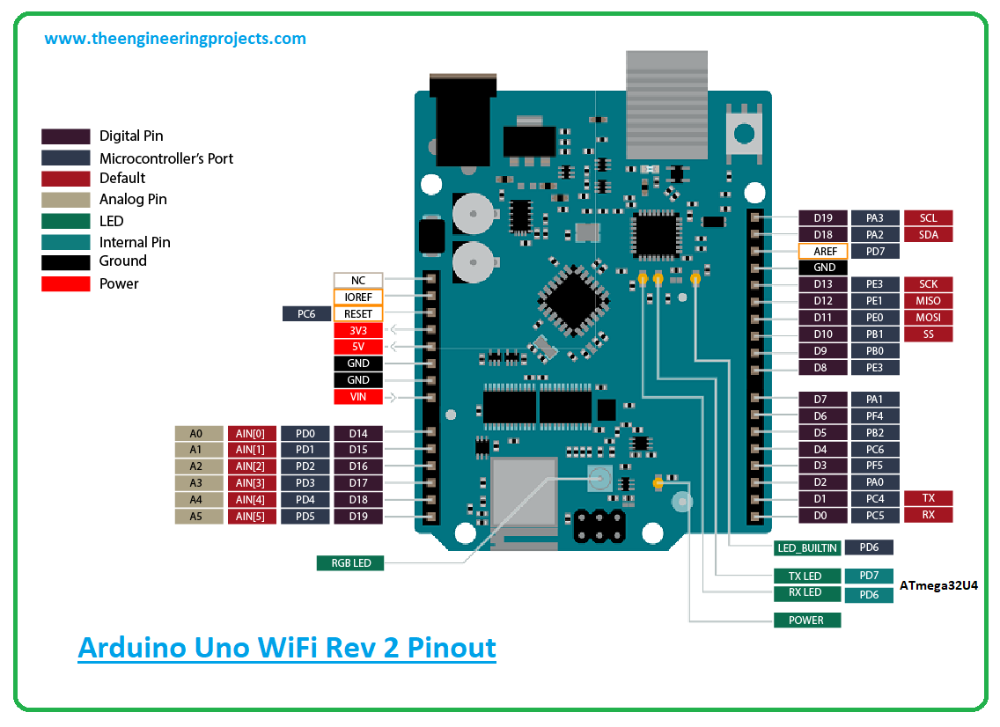
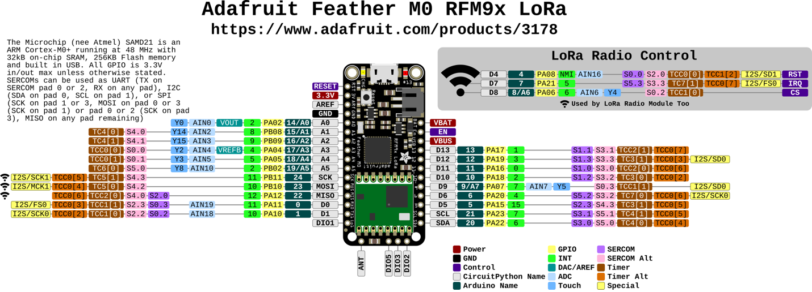

## Lono Smart Sprinkler System
CreateX Spring 2023 Capstone Project

## 1. Arduino setup:
### 1.1 Arduino Uno WiFi pinout

## 2. Feather Setup
### 1.1. LoRa Arduino Library Setup 
Install the radio head library here ([link](https://learn.adafruit.com/adafruit-feather-m0-radio-with-lora-radio-module/using-the-rfm-9x-radio)). Put it into your Arduino libraries folder as described here ([link](https://learn.adafruit.com/adafruit-all-about-arduino-libraries-install-use)). 

### 1.2 General Setup
Follow this guide ([link](https://learn.adafruit.com/adafruit-feather-m0-radio-with-lora-radio-module/overview)). 

processor: 
ATSAMD21G18 ARM Cortex M0

Pin connections (feather --> sensor) 
- 3.3v --> VCC
- GND --> GND
- A0 (analog in) --> AOUT

Other Notes: 
- 8, 4, 3 used for radio module
- Serial out: 9600 baud 

